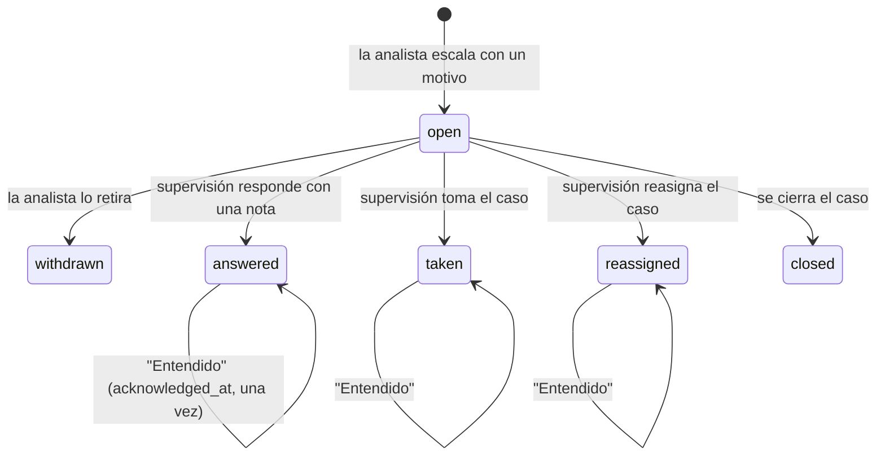

# Modelo de datos de la plataforma

Versión: slices 0 a 11 (slice 7: calificación del cliente; slice 8: prioridad del caso; slice 9: escalamientos a supervisión; slice 10: notificaciones; slice 11: altas seguras por invitación, parte 4). Fuente de verdad: `backend/src/cc_platform/infrastructure/persistence/sqlalchemy/tables.py` (tablas) y `backend/src/cc_platform/domain/` (reglas y valores permitidos). El contrato de la API está en `backend/openapi.json`.

La plataforma es solo para personas: clientes y equipo de soporte conversan por chat. Guarda las conversaciones, quién atiende cada caso, las cuentas del equipo y el registro de eventos; nada más (la [última sección](#diferencias-con-contractsplatform_historyjson) compara este modelo con la muestra sintética).

## Cómo se guarda

- Base de datos SQLite por defecto, escrita con SQL portable para pasar a Postgres sin cambios.
- **No hay migraciones todavía**: el esquema se crea al arrancar. Si cambia, se borra `backend/cc_platform.db` y se vuelve a crear con los datos de ejemplo.
- Ids de texto con prefijo: `CASE-…`, `TRN-…` (mensaje), `ASG-…` (asignación), `CUS-…` (cliente), `STF-…` (persona del equipo), `SES-…` (sesión), `MFA-…`, `TEAM-…` (equipo), `EVT-…` (evento), `CSN-…` (sesión de cliente), `ESC-…` (escalamiento), `NTF-…` (notificación), `INV-…` (invitación), `PWR-…` (enlace para restablecer la contraseña), `EML-…` (correo del buzón de desarrollo).
- Fechas en UTC (ISO-8601).
- Las tablas con columna `version` usan control de concurrencia optimista: si dos personas cambian lo mismo a la vez, la segunda escritura se rechaza y se reintenta sobre datos frescos.
- `turns` y `event_log` son de solo agregar: nunca se editan ni se borran filas.

## Diagrama

```mermaid
erDiagram
    customers ||--o{ cases : "abre"
    customers ||--|| customer_case_slots : "a lo sumo un caso abierto"
    cases ||--o{ turns : "mensajes"
    cases ||--o{ assignments : "historial de asignaciones"
    cases |o--o| cases : "previous_case_id"
    teams ||--o{ staff : "miembros"
    staff ||--o{ assignments : "recibe"
    staff ||--o{ cases : "assigned_analyst_id"
    staff ||--|| login_accounts : "credenciales"
    staff ||--o{ mfa_challenges : "códigos"
    staff ||--o{ staff_sessions : "sesiones"
    staff ||--o| analyst_availability : "disponible / en pausa"
    cases ||--o{ event_log : "case_id"
    cases ||--o{ escalations : "escalamientos (uno abierto a la vez)"
    staff ||--o{ escalations : "escalated_by_id"
    staff ||--o{ notifications : "recipient_id (las últimas 200)"
    staff ||--o| invitations : "una invitación por persona"
    staff ||--o| password_resets : "un enlace para restablecer por persona"

    customers {
        string id PK "CUS-…"
        string display_name
        string country "CO MX AR BR"
        string city
        string locale "es-CO es-MX es-AR pt-BR"
        bool simulator
        json suggestions
    }
    cases {
        string id PK "CASE-…"
        string customer_id FK
        string channel "app_chat web_chat"
        string language "es pt"
        string priority "none low medium high critical"
        string status "queued assigned in_progress closed"
        datetime opened_at
        datetime sla_due_at
        datetime first_response_at
        string previous_case_id
        string assigned_analyst_id FK
        datetime assigned_at
        datetime queued_at
        datetime closed_at
        string close_reason
        string close_note
        int rating_score "1 a 4, slice 7"
        string rating_comment
        datetime rated_at
        string rating_key
        string open_escalation_id "slice 9"
        int version
    }
    escalations {
        string id PK "ESC-…"
        string case_id FK
        string state "open answered taken reassigned withdrawn closed"
        string motive "hasta 500"
        string escalated_by_id FK
        datetime escalated_at
        datetime resolved_at
        string resolved_by_id
        string note "respuesta de supervisión"
        string reassigned_to_id
        datetime acknowledged_at
        string creation_key
        int version
    }
    turns {
        string id PK "TRN-…"
        string case_id FK
        int sequence "sin huecos por caso"
        string kind "message routing notice"
        string audience "everyone staff"
        string author_role "customer analyst system"
        string author_id
        text text
        string language
        datetime created_at
        string client_message_id
    }
    assignments {
        string id PK "ASG-…"
        string case_id FK
        string staff_id FK
        string reason "language_least_loaded queue_drained manual"
        string policy_rule_id "H1"
        int open_cases_at_assignment
        string assigned_by_role
        string assigned_by_id
        int waited_seconds
        string previous_staff_id
        bool paused_override
        datetime assigned_at
    }
    customer_case_slots {
        string customer_id PK
        string open_case_id
        int version
    }
    staff {
        string id PK "STF-…"
        string name
        string email UK
        json roles "analyst supervisor admin"
        json languages "es pt"
        string team_id FK
        bool active
        string setup "invited withdrawn complete (parte 4)"
        datetime created_at
        int version
    }
    teams {
        string id PK "TEAM-…"
        string name
        string name_key UK
        bool active
        int version
    }
    admin_roster {
        string id PK "default"
        json admin_ids
        int version
    }
    login_accounts {
        string staff_id PK
        string password_hash
        int failed_attempts
        datetime locked_until
        datetime last_login_at
        string totp_secret "sellado (Fernet); nulo solo en cuentas sembradas"
    }
    invitations {
        string id PK "INV-…"
        string staff_id FK "único"
        string token_hash "SHA-256, único"
        string state "pending accepted cancelled"
        datetime sent_at
        datetime expires_at "48 h"
        int resend_count
        int version
    }
    password_resets {
        string id PK "PWR-…"
        string staff_id FK "único"
        string token_hash "SHA-256, único"
        string state "pending used"
        datetime expires_at "1 h"
        int version
    }
    mfa_challenges {
        string id PK "MFA-…"
        string staff_id FK
        datetime expires_at
        int attempts
        string status
    }
    staff_sessions {
        string id PK "SES-…"
        string staff_id FK
        datetime issued_at
        datetime expires_at
        datetime ended_at
        string end_reason
    }
    analyst_availability {
        string staff_id PK
        string status "available paused"
        datetime since
    }
    notifications {
        string id PK "NTF-…"
        string recipient_id FK
        string kind "14 tipos (slice 10)"
        datetime created_at "cuándo pasó el hecho"
        string source_key "EVT-… o sla:CASE-…"
        string case_id
        string customer_id
        string actor_id
        string target_id
        string escalation_id
        string language
        int score
        int failed_attempts
        datetime read_at
        int version
    }
    event_log {
        int sequence PK "orden total"
        string event_id UK "EVT-…"
        string event_type
        string entity
        string entity_id
        string case_id
        string actor_role
        string actor_id
        datetime event_time
        datetime ingested_at
        json payload
    }
```

## Ciclo de vida de un caso

```mermaid
stateDiagram-v2
    [*] --> queued: el cliente escribe
    queued --> assigned: hay alguien disponible que habla el idioma,\nse libera alguien, o supervisión lo asigna
    assigned --> in_progress: el analista lo abre o responde
    assigned --> assigned: supervisión lo reasigna
    in_progress --> assigned: supervisión lo reasigna
    assigned --> closed: el analista lo cierra con motivo
    in_progress --> closed: el analista lo cierra con motivo
    closed --> closed: el cliente lo califica (una vez, slice 7)
    assigned --> assigned: la analista o supervisión cambia la prioridad (slice 8)
    assigned --> assigned: la analista escala a supervisión (slice 9; el caso sigue con ella)
    in_progress --> in_progress: la analista escala a supervisión (slice 9)
    in_progress --> in_progress: la analista o supervisión cambia la prioridad (slice 8)
    closed --> [*]
```

- Un caso cerrado no se reabre: si el cliente vuelve a escribir, se abre un caso nuevo con `previous_case_id` apuntando al anterior.
- Un cliente tiene como máximo un caso abierto (`customer_case_slots`).
- Regla 3 (`policy_rule_id = H1`): un caso en portugués solo va a quien habla portugués. Entre los elegibles, va a quien tenga menos casos abiertos. Si no hay nadie disponible, queda en cola (`queued`).
- Calificación del cliente (slice 7): solo un caso **cerrado**, **una vez**, y solo su propio
  cliente. No cambia el estado (sigue cerrado y de solo lectura). Cuenta para quien lo cerró
  (`closed_by_id`).
- Plazo de primera respuesta (`sla_due_at`): 15 minutos para todos los casos (slice 8; antes
  dependía de la prioridad). El primer mensaje del analista fija `first_response_at`.
- Prioridad (slice 8): todo caso abre con `none` ("Sin prioridad"). La cambia quien lo atiende
  (con el rol Analista) o Supervisión (cualquier caso abierto, también en cola); nunca en un caso
  cerrado. No cambia el estado ni el plazo de primera respuesta. Los niveles siguen
  `complaints.priority` del dataset (Low, Medium, High, Critical) más `none`.

- Escalamiento a supervisión (slice 9): solo dice que el caso se escaló y por qué (el dataset solo
  tiene `was_escalated` sí/no: no hay tipos, montos, límites, niveles ni plazos). Lo escala quien
  lo atiende, uno abierto a la vez (`cases.open_escalation_id`); supervisión responde, toma el caso
  (si también es Analista y habla el idioma) o lo reasigna; cerrar el caso lo termina.

**Estado en la bandeja del analista** (se calcula, no se guarda):

| Bandeja | Condición |
|---|---|
| Nuevos | `assigned` (el analista todavía no lo abre) |
| Por responder | `in_progress` y el último mensaje es del cliente |
| Esperando al cliente | `in_progress` y el último mensaje es del analista |
| Cerrados | `closed` en los últimos 7 días |

## Tablas

### Conversación

**`customers`** · perfil mínimo del cliente. Solo datos de ejemplo; ningún caso de uso lo escribe todavía.

| Columna | Tipo | Notas |
|---|---|---|
| `id` | texto, PK | `CUS-…` |
| `display_name` | texto | nombre visible |
| `country` | texto(2) | CO, MX, AR, BR |
| `city` | texto | |
| `locale` | texto | es-CO, es-MX, es-AR, pt-BR (define el idioma del caso) |
| `simulator` | booleano | disponible en el simulador de cliente |
| `suggestions` | JSON | frases de inicio del simulador (solo demo) |

**`cases`** · un chat, desde el primer mensaje del cliente hasta el cierre.

| Columna | Tipo | Notas |
|---|---|---|
| `id` | texto, PK | `CASE-…` |
| `customer_id` | FK → customers | |
| `channel` | texto | `app_chat`, `web_chat` |
| `language` | texto | `es`, `pt` |
| `priority` | texto | `none` (al abrir), `low`, `medium`, `high`, `critical` (slice 8); la cambia la analista asignada o Supervisión |
| `status` | texto | `queued`, `assigned`, `in_progress`, `closed` |
| `opened_at` | fecha | |
| `sla_due_at` | fecha | vencimiento de la primera respuesta |
| `first_response_at` | fecha, nula | primer mensaje del analista |
| `previous_case_id` | texto, nulo | caso anterior del mismo cliente |
| `assigned_analyst_id` | FK → staff, nula | analista actual |
| `assigned_at`, `queued_at` | fecha, nula | |
| `queue_label` | texto, nulo | nombre de la cola mientras espera |
| `last_sequence`, `last_public_sequence` | entero | último mensaje (todos / visibles al cliente) |
| `last_message_at`, `last_message_author_role`, `last_message_preview` | | resumen del último mensaje para la bandeja |
| `last_turn_author_role`, `last_turn_preview` | | ídem, incluyendo avisos del sistema |
| `assignee_read_sequence`, `unread_sequences` | entero, JSON | lectura del analista asignado |
| `search_text` | texto | texto normalizado para buscar |
| `closed_at`, `closed_by_id`, `closed_by_role` | | cierre |
| `close_reason` | texto, nulo | `resolved`, `customer_unresponsive`, `duplicate`, `out_of_scope`, `other` |
| `close_note` | texto(500), nulo | nota opcional |
| `rating_score` | entero, nulo | calificación del cliente (slice 7): 1 Mal, 2 Regular, 3 Bien, 4 Excelente; solo en un caso cerrado |
| `rating_comment` | texto(500), nulo | comentario opcional del cliente (sin espacios sobrantes; vacío = nulo) |
| `rated_at` | fecha, nula | cuándo calificó |
| `rating_key` | texto(64), nulo | `Idempotency-Key` de la solicitud: un reintento con la misma respuesta no califica dos veces |
| `open_escalation_id` | texto, nulo | escalamiento abierto ahora (slice 9); a lo sumo uno por caso |
| `version` | entero | concurrencia optimista (una calificación, un cambio de prioridad o un escalamiento sube la versión: dos a la vez, gana una; el cambio de prioridad además exige la versión que vio quien lo pide, `expectedVersion`) |

Índice de "Calificación 7 días" (slice 7): `ix_cases_closer_closed` (`closed_by_id`, `closed_at`).
La supervisión agrupa por quien cerró los casos calificados con `closed_at` en los últimos 7 días
(cantidad y promedio, una sola consulta).

**Por qué en `cases` y no en una tabla aparte.** La calificación es un dato del cierre, una por
caso y escrita una sola vez; guardarla en el mismo agregado reutiliza su control de concurrencia
(`version`) y su registro de eventos, sin otra tabla ni otra regla de unicidad.

**`escalations`** · escalamientos a supervisión (slice 9). Una fila por escalamiento: un caso puede
escalarse otra vez cuando el anterior terminó.

| Columna | Tipo | Notas |
|---|---|---|
| `id` | texto, PK | `ESC-…` |
| `case_id` | FK → cases | |
| `state` | texto | `open`, `answered`, `taken`, `reassigned`, `withdrawn`, `closed` |
| `motive` | texto(500) | por qué escaló (texto del equipo; la auditoría muestra solo su largo) |
| `escalated_by_id`, `escalated_at` | FK → staff, fecha | quién escaló (quien atendía el caso) y cuándo |
| `resolved_at`, `resolved_by_id` | fecha, texto, nulos | cuándo y quién lo terminó |
| `note` | texto(500), nulo | respuesta de supervisión (`answered`; la auditoría muestra solo su largo) |
| `reassigned_to_id` | texto, nulo | quién tiene el caso ahora (`taken`: quien lo tomó desde supervisión; `reassigned`) |
| `acknowledged_at` | fecha, nula | la analista leyó lo que hizo supervisión ("Entendido") |
| `creation_key` | texto(64), único, nulo | `Idempotency-Key` del pedido que lo abrió |
| `version` | entero | concurrencia optimista |

Índices: `(case_id, escalated_at)`, `(state, escalated_at)` y `(resolved_at)` ("Escalados": los
abiertos y los atendidos desde una hora). "Colas" (slice 9) usa `ix_cases_language_status`
(`language`, `status`) para leer todos los casos abiertos de un idioma.

**Por qué un agregado propio y no columnas en `cases`.** Un caso puede escalarse más de una vez y
supervisión lista escalamientos, no casos. La regla "uno abierto por caso" vive en el caso
(`open_escalation_id`): cada comando que abre o termina un escalamiento guarda también el caso
(escribe un aviso para el equipo en la conversación), así que el control de concurrencia del caso
los ordena.

**`turns`** · cada mensaje o aviso del chat. Solo se agregan filas.

| Columna | Tipo | Notas |
|---|---|---|
| `id` | texto, PK | `TRN-…` |
| `case_id` | FK → cases | |
| `sequence` | entero | 1, 2, 3… sin huecos dentro del caso (único por caso) |
| `kind` | texto | `message` (escrito por una persona), `routing` (aviso de asignación), `notice` (aviso de cierre, reasignación…) |
| `audience` | texto | `everyone` (lo ve el cliente) o `staff` (solo el equipo) |
| `author_role` | texto | `customer`, `analyst`, `system` |
| `author_id` | texto, nulo | `CUS-…` o `STF-…` |
| `text` | texto | contenido |
| `language` | texto | `es`, `pt` |
| `created_at` | fecha | |
| `client_message_id` | texto, nulo | evita duplicados si se reenvía (único por autor) |

**`assignments`** · historial de a quién se asignó cada caso. Índices de "Inicio" (slice 6):
`(staff_id, assigned_at)` y `(previous_staff_id, assigned_at)`, para leer qué casos le llegaron
o le quitaron a una analista desde su sesión anterior. "Mientras no estabas" no tiene tabla
propia: se lee de `event_log`, `assignments` y `cases`.

| Columna | Tipo | Notas |
|---|---|---|
| `id` | texto, PK | `ASG-…` |
| `case_id` | FK → cases | |
| `staff_id` | FK → staff | analista que lo recibe |
| `reason` | texto | `language_least_loaded` (al llegar), `queue_drained` (desde la cola), `manual` (lo eligió supervisión) |
| `policy_rule_id` | texto, nulo | `H1` (regla 3, idioma) |
| `open_cases_at_assignment` | entero | carga del analista en ese momento |
| `strategy` | texto | estrategia de asignación usada |
| `assigned_by_role`, `assigned_by_id` | texto | sistema o supervisión |
| `waited_seconds` | entero, nulo | tiempo en cola |
| `previous_staff_id` | texto, nulo | quién lo tenía antes (reasignación) |
| `paused_override` | booleano | se asignó a alguien en pausa con confirmación |
| `assigned_at` | fecha | |

**`customer_case_slots`** · garantiza un solo caso abierto por cliente (`customer_id` PK, `open_case_id`, `version`).

### Notificaciones (slice 10)

**`notifications`** · lo que cada persona del equipo debe saber (la campana del riel). Se
**derivan** de hechos que ya están en `event_log` (un proyector suscrito al bus de eventos) y del
plazo de primera respuesta a punto de vencer (un barrido periódico). Solo datos estructurados: el
texto en español lo pone el frontend con plantillas fijas. Sin IA.

| Columna | Tipo | Notas |
|---|---|---|
| `id` | texto, PK | `NTF-…` |
| `recipient_id` | FK → staff | a quién le llega |
| `kind` | texto | Analista: `assigned_on_arrival`, `assigned_from_queue`, `assigned_by_supervisor`, `reassigned_away`, `customer_returned`, `escalation_answered`, `escalation_taken`, `escalation_reassigned`, `case_rated`; Supervisión: `case_escalated`, `case_queued`, `sla_at_risk`; Administración: `account_locked`, `invitation_accepted` |
| `created_at` | fecha | cuándo pasó el hecho (la hora del evento de origen), no cuándo se escribió |
| `source_key` | texto(80) | idempotencia: el id del evento de origen (`EVT-…`) o `sla:<caso>` del barrido; único por persona |
| `case_id`, `customer_id` | texto, nulos | el caso y su cliente (tipos de caso) |
| `actor_id` | texto, nulo | quién actuó (supervisión que asignó, respondió o tomó; la analista que escaló) |
| `target_id` | texto, nulo | sobre quién (quien tiene el caso ahora; la persona bloqueada o invitada) |
| `escalation_id` | texto, nulo | el escalamiento (`case_escalated`, `escalation_*`) |
| `language` | texto, nulo | idioma del caso |
| `score` | entero, nulo | `case_rated`: la calificación (1 a 4) |
| `failed_attempts` | entero, nulo | `account_locked`: intentos fallidos |
| `read_at` | fecha, nula | cuándo la leyó (una sola vez) |
| `version` | entero | concurrencia optimista (leer una es compare-and-set; "Marcar todas" es un `UPDATE … WHERE read_at IS NULL` condicional) |

Índices: único `(recipient_id, source_key)`; `(recipient_id, created_at, id)` (la lista, más nueva
primero, con cursor; y la retención); `(recipient_id, read_at)` (cuántas sin leer).

Reglas: nunca le llega a quien hizo la acción ni a una persona inactiva; de Supervisión y
Administración, a todas las personas activas con ese rol. "Un caso espera en la cola" llega una vez
por idioma mientras la cola no se vacíe. "Caso por vencer sin respuesta": un caso abierto sin
primera respuesta a 5 minutos o menos de vencer, una vez por caso, revisado al arrancar y cada 30 s
(`CC_NOTIFICATION_SWEEP_SECONDS`). **Retención (generada por el equipo):** se guardan las 200 más
recientes por persona; las más viejas se borran al escribir una nueva.

**Por qué no está en `event_log`.** Una notificación es una proyección de un hecho que ya está en el
registro (`source_key` lo nombra) y "leída" es estado personal de la interfaz: registrarlas
duplicaría la auditoría. Ver `api/slice-10-notifications.md`.

### Personas y acceso

| Tabla | Para qué | Columnas principales |
|---|---|---|
| `staff` | personas del equipo | `id` (`STF-…`), `name`, `email` (único), `roles` (JSON: `analyst`, `supervisor`, `admin`, combinables, al menos uno), `languages` (JSON: `es`, `pt`), `team_id` (FK → teams), `active`, `created_at`, `creation_key`, `setup` (parte 4: `invited` = invitación pendiente, sin contraseña, no puede entrar; `withdrawn` = invitación cancelada antes de activarla, no aparece en el directorio; `complete` = activada o sembrada. Solo una cuenta `complete` puede estar `active`), `version` |
| `teams` | equipos | `id` (`TEAM-…`), `name`, `name_key` (nombre sin mayúsculas ni tildes, único), `active` (solo se desactiva sin miembros activos), `created_at`, `creation_key`, `version` |
| `admin_roster` | garantiza que siempre quede al menos un administrador activo | una sola fila (`id = default`), `admin_ids` (JSON), `version` |
| `login_accounts` | credenciales y bloqueo | `staff_id`, `password_hash` (Argon2id), `failed_attempts`, `locked_until` (5 intentos fallidos → 15 min), `last_login_at`, `totp_secret` (parte 4: la clave de su app de autenticación, RFC 6238, **sellada** con Fernet; nunca se vuelve a mostrar; nula solo en las cuentas sembradas de desarrollo, que usan el código `000000`). Una persona invitada no tiene fila hasta que activa su cuenta |
| `invitations` | invitaciones por correo (parte 4) | `id` (`INV-…`), `staff_id` (único: una por persona), `token_hash` (SHA-256 del enlace de un solo uso; el enlace nunca se guarda), `state` (`pending`, `accepted`, `cancelled`; "vencida" se calcula: pendiente después de `expires_at`), `created_at`, `sent_at` (último envío), `expires_at` (48 h después del último envío), `created_by`, `resend_count`, `accepted_at`, `cancelled_at`, `password_hash` y `totp_secret` (sellado) mientras la persona está entre el paso 1 y el 2, `failed_codes` / `locked_until` (5 códigos erróneos → 15 min), `version`. Reenviar reemplaza el enlace (el anterior deja de servir) |
| `password_resets` | enlaces para restablecer la contraseña (parte 4) | `id` (`PWR-…`), `staff_id` (único: un enlace vigente por persona; uno nuevo reemplaza al anterior), `token_hash` (SHA-256), `state` (`pending`, `used`; vencido se calcula), `sent_at`, `expires_at` (1 h), `created_by`, `used_at`, `version` |
| `dev_mailbox` | solo desarrollo: lo que "envió" el buzón de desarrollo (parte 4) | `id` (`EML-…`), `kind` (`invitation`, `password_reset`), `to_address`, `subject`, `text`, `link`, `sent_at`; se guardan los 200 más recientes. Nunca se escribe en producción (`CC_DEV_MAILBOX` lo prohíbe) |
| `mfa_challenges` | código de verificación | `id`, `staff_id`, `issued_at`, `expires_at`, `max_attempts`, `attempts`, `status` (se cancela si restablecen la contraseña o desactivan a la persona), `verified_at`, `method` |
| `staff_sessions` | sesiones iniciadas | `id`, `staff_id`, `issued_at`, `expires_at`, `mfa_method`, `ended_at`, `end_reason` |
| `analyst_availability` | disponible o en pausa | `staff_id`, `status` (`available`, `paused`), `since` |

**Altas seguras (parte 4).** Ninguna tabla guarda una contraseña en claro, un enlace o una clave
de verificación legible: solo hashes (Argon2id para contraseñas, SHA-256 para los enlaces de un
solo uso) y la clave TOTP sellada. Los eventos nunca llevan correos, enlaces, contraseñas ni
claves. Ver `api/slice-11-invitations.md`.

### Registro de eventos

**`event_log`** · todo cambio de estado deja una fila. Solo se agregan filas.

| Columna | Tipo | Notas |
|---|---|---|
| `sequence` | entero, PK | orden total de llegada (paginación y exportación) |
| `event_id` | texto, único | `EVT-…` |
| `event_type` | texto | ver lista abajo |
| `entity`, `entity_id` | texto | sobre qué entidad ocurrió |
| `case_id` | texto, nulo | caso relacionado |
| `actor_role`, `actor_id` | texto | `customer`, `analyst`, `supervisor`, `admin` o `system`, y su id |
| `event_time` | fecha | cuándo ocurrió |
| `ingested_at` | fecha | cuándo se guardó |
| `payload` | JSON | detalle del evento |

Tipos de evento:

| Familia | Eventos |
|---|---|
| Casos | `case.opened`, `case.queued`, `case.assigned`, `case.status_changed`, `case.read`, `case.first_responded`, `case.closed`, `case.rated` (el cliente calificó; `payload`: `score`, `comment`, `analyst_id`; la auditoría muestra solo el largo del comentario), `case.priority_changed` (slice 8; `payload`: `from`, `to`; auditoría: "Cambió la prioridad a Alta"), `case.viewed` (supervisión abrió el caso) |
| Escalamientos (slice 9) | `escalation.opened` (`motive`, `analyst_id`; auditoría: "Escaló el caso a supervisión", solo el largo del motivo), `escalation.withdrawn`, `escalation.answered` (`note`; solo su largo), `escalation.taken`, `escalation.reassigned` (`previous_analyst_id`, `analyst_id`), `escalation.closed`, `escalation.acknowledged` |
| Mensajes | `turn.created` |
| Equipo | `staff.availability_changed` |
| Administración | `staff.created`, `staff.profile_updated`, `staff.roles_changed`, `staff.languages_changed`, `staff.team_changed`, `staff.deactivated`, `staff.reactivated`, `staff.account_unlocked`, `team.created`, `team.renamed`, `team.deactivated`, `team.reactivated`; parte 4: `staff.invitation_sent` (`invitation_id`, `expires_at`), `staff.invitation_resent` (+ `resend_count`), `staff.invitation_cancelled`, `staff.password_reset_link_sent` (`reset_id`, `expires_at`, `revoked_sessions`, `cleared_lock`) |
| Acceso | `auth.login_failed`, `auth.password_accepted`, `auth.mfa_challenge_issued`, `auth.mfa_failed`, `auth.account_locked`, `auth.session_started`, `auth.session_ended`, `customer.session_started`; parte 4 (la persona misma): `staff.invitation_accepted` (`invitation_id`), `staff.mfa_enrolled` (`method: totp`), `staff.password_reset` (`cleared_lock`: creó su contraseña nueva con el enlace) |

## Lo que todavía puede cambiar

- Slice 7 agrega las columnas de calificación a `cases`: una base creada antes falla al arrancar
  (`OutdatedSchemaError`) hasta borrarla.
- Slice 8 no agrega columnas, pero cambia los valores de `priority`, el plazo de primera
  respuesta y la historia sembrada: borra `backend/cc_platform.db` para verlos (una base anterior
  arranca, con `medium` en sus casos y los plazos viejos).
- Slice 9 agrega la tabla `escalations` y la columna `cases.open_escalation_id`: una base anterior
  falla al arrancar (`OutdatedSchemaError`) hasta borrarla.
- Slice 10 agrega la tabla `notifications`: una base anterior falla al arrancar
  (`OutdatedSchemaError`) hasta borrarla.
- Slice 11 (parte 4) agrega las tablas `invitations`, `password_resets` y `dev_mailbox` y las
  columnas `staff.setup` y `login_accounts.totp_secret`: una base anterior falla al arrancar
  (`OutdatedSchemaError`) hasta borrarla.
- Pendiente conocido: no hay migraciones. Cualquier cambio futuro de esquema exige borrar `backend/cc_platform.db` hasta que se agreguen.

## Diferencias con `contracts/platform_history.json`

Ese contrato (v0.5.1) describe la muestra sintética que compartimos para el equipo de IA, que incluía la plataforma completa con IA. La plataforma construida es un subconjunto:

| En el contrato de la muestra | En la plataforma |
|---|---|
| `case`, `turn` | sí (`cases`, `turns`); faltan `origin`, `topic`, `complaint_id` en el caso y `from_suggestion_id`, `evidence_ids` en el mensaje |
| `case_close` (`resolved`, `contact_reason`, `resolution_code`, `followup_at`, `csat`) | distinto: dentro de `cases`, `close_reason` y `close_note`; `csat` (misma escala 1 a 4) es `rating_score` + `rating_comment`, que pone el cliente después del cierre (slice 7) |
| `was_escalated` (sí/no) | sí, como `escalations`: el motivo y lo que hizo supervisión; sin tipos, montos, niveles ni plazos |
| `routing_step` (juez, árbol, agente, humano) | no: el caso va directo a una persona; quién lo recibió y por qué queda en `assignments`, que es nuevo |
| canales `phone`, `email`; origen `regulator`, `branch` | no: solo `app_chat` y `web_chat` |
| tema del caso (`topic`) | no existe (lo asignaba el juez) |
| `tool_call`, `identity_check`, `copilot_query`, `approval`, `suggestion`, `signal`, `component` | no existen |
