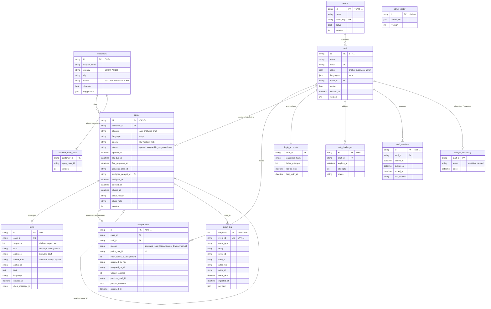
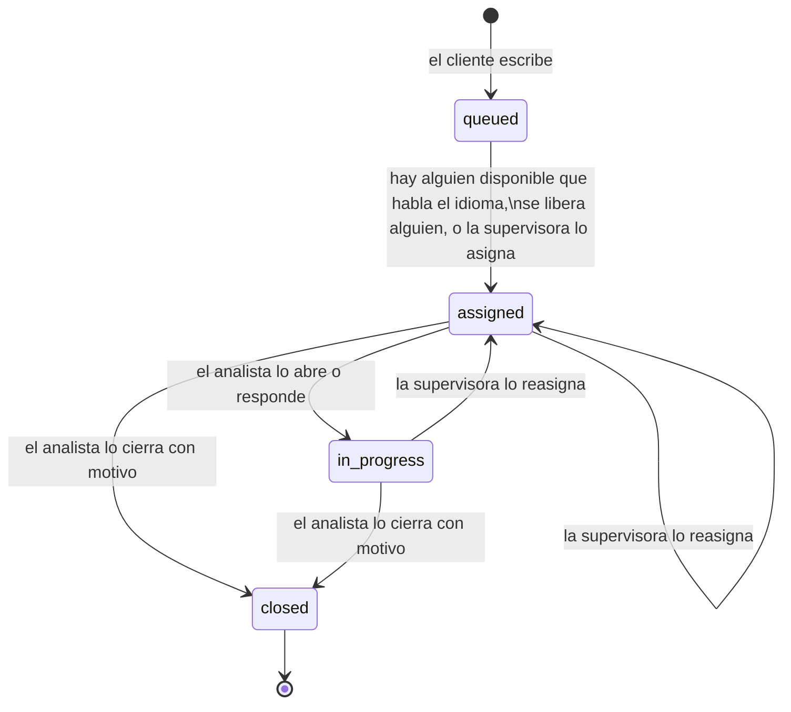

# Modelo de datos de la plataforma

Versión: slices 0 a 4. Fuente de verdad: `backend/src/cc_platform/infrastructure/persistence/sqlalchemy/tables.py` (tablas) y `backend/src/cc_platform/domain/` (reglas y valores permitidos). El contrato de la API está en `backend/openapi.json`.

La plataforma es solo para personas: clientes y equipo de soporte conversan por chat. Guarda las conversaciones, quién atiende cada caso, las cuentas del equipo y el registro de eventos; nada más (la [última sección](#diferencias-con-contractsplatform_historyjson) compara este modelo con la muestra sintética).

## Cómo se guarda

- Base de datos SQLite por defecto, escrita con SQL portable para pasar a Postgres sin cambios.
- **No hay migraciones todavía**: el esquema se crea al arrancar. Si cambia, se borra `backend/cc_platform.db` y se vuelve a crear con los datos de ejemplo.
- Ids de texto con prefijo: `CASE-…`, `TRN-…` (mensaje), `ASG-…` (asignación), `CUS-…` (cliente), `STF-…` (persona del equipo), `SES-…` (sesión), `MFA-…`, `TEAM-…` (equipo), `EVT-…` (evento), `CSN-…` (sesión de cliente).
- Fechas en UTC (ISO-8601).
- Las tablas con columna `version` usan control de concurrencia optimista: si dos personas cambian lo mismo a la vez, la segunda escritura se rechaza y se reintenta sobre datos frescos.
- `turns` y `event_log` son de solo agregar: nunca se editan ni se borran filas.

## Diagrama

## Ciclo de vida de un caso

- Un caso cerrado no se reabre: si el cliente vuelve a escribir, se abre un caso nuevo con `previous_case_id` apuntando al anterior.
- Un cliente tiene como máximo un caso abierto (`customer_case_slots`).
- Regla 3 (`policy_rule_id = H1`): un caso en portugués solo va a quien habla portugués. Entre los elegibles, va a quien tenga menos casos abiertos. Si no hay nadie disponible, queda en cola (`queued`).
- Plazo de primera respuesta (`sla_due_at`): 5, 15 o 60 minutos según la prioridad alta, media o baja. El primer mensaje del analista fija `first_response_at`.

**Estado en la bandeja del analista** (se calcula, no se guarda):

| Bandeja | Condición |
|---|---|
| Nuevos | `assigned` (el analista todavía no lo abre) |
| Por responder | `in_progress` y el último mensaje es del cliente |
| Esperando al cliente | `in_progress` y el último mensaje es del analista |
| Cerrados | `closed` en los últimos 7 días |

## Tablas

### Conversación

**`customers`** · perfil mínimo del cliente. Solo datos de ejemplo; ningún caso de uso lo escribe todavía.

| Columna | Tipo | Notas |
|---|---|---|
| `id` | texto, PK | `CUS-…` |
| `display_name` | texto | nombre visible |
| `country` | texto(2) | CO, MX, AR, BR |
| `city` | texto | |
| `locale` | texto | es-CO, es-MX, es-AR, pt-BR (define el idioma del caso) |
| `simulator` | booleano | disponible en el simulador de cliente |
| `suggestions` | JSON | frases de inicio del simulador (solo demo) |

**`cases`** · un chat, desde el primer mensaje del cliente hasta el cierre.

| Columna | Tipo | Notas |
|---|---|---|
| `id` | texto, PK | `CASE-…` |
| `customer_id` | FK → customers | |
| `channel` | texto | `app_chat`, `web_chat` |
| `language` | texto | `es`, `pt` |
| `priority` | texto | `low`, `medium`, `high` |
| `status` | texto | `queued`, `assigned`, `in_progress`, `closed` |
| `opened_at` | fecha | |
| `sla_due_at` | fecha | vencimiento de la primera respuesta |
| `first_response_at` | fecha, nula | primer mensaje del analista |
| `previous_case_id` | texto, nulo | caso anterior del mismo cliente |
| `assigned_analyst_id` | FK → staff, nula | analista actual |
| `assigned_at`, `queued_at` | fecha, nula | |
| `queue_label` | texto, nulo | nombre de la cola mientras espera |
| `last_sequence`, `last_public_sequence` | entero | último mensaje (todos / visibles al cliente) |
| `last_message_at`, `last_message_author_role`, `last_message_preview` | | resumen del último mensaje para la bandeja |
| `last_turn_author_role`, `last_turn_preview` | | ídem, incluyendo avisos del sistema |
| `assignee_read_sequence`, `unread_sequences` | entero, JSON | lectura del analista asignado |
| `search_text` | texto | texto normalizado para buscar |
| `closed_at`, `closed_by_id`, `closed_by_role` | | cierre |
| `close_reason` | texto, nulo | `resolved`, `customer_unresponsive`, `duplicate`, `out_of_scope`, `other` |
| `close_note` | texto(500), nulo | nota opcional |
| `version` | entero | concurrencia optimista |

**`turns`** · cada mensaje o aviso del chat. Solo se agregan filas.

| Columna | Tipo | Notas |
|---|---|---|
| `id` | texto, PK | `TRN-…` |
| `case_id` | FK → cases | |
| `sequence` | entero | 1, 2, 3… sin huecos dentro del caso (único por caso) |
| `kind` | texto | `message` (escrito por una persona), `routing` (aviso de asignación), `notice` (aviso de cierre, reasignación…) |
| `audience` | texto | `everyone` (lo ve el cliente) o `staff` (solo el equipo) |
| `author_role` | texto | `customer`, `analyst`, `system` |
| `author_id` | texto, nulo | `CUS-…` o `STF-…` |
| `text` | texto | contenido |
| `language` | texto | `es`, `pt` |
| `created_at` | fecha | |
| `client_message_id` | texto, nulo | evita duplicados si se reenvía (único por autor) |

**`assignments`** · historial de a quién se asignó cada caso. Índices de "Inicio" (slice 6):
`(staff_id, assigned_at)` y `(previous_staff_id, assigned_at)`, para leer qué casos le llegaron
o le quitaron a una analista desde su sesión anterior. "Mientras no estabas" no tiene tabla
propia: se lee de `event_log`, `assignments` y `cases`.

| Columna | Tipo | Notas |
|---|---|---|
| `id` | texto, PK | `ASG-…` |
| `case_id` | FK → cases | |
| `staff_id` | FK → staff | analista que lo recibe |
| `reason` | texto | `language_least_loaded` (al llegar), `queue_drained` (desde la cola), `manual` (lo eligió una supervisora) |
| `policy_rule_id` | texto, nulo | `H1` (regla 3, idioma) |
| `open_cases_at_assignment` | entero | carga del analista en ese momento |
| `strategy` | texto | estrategia de asignación usada |
| `assigned_by_role`, `assigned_by_id` | texto | sistema o supervisora |
| `waited_seconds` | entero, nulo | tiempo en cola |
| `previous_staff_id` | texto, nulo | quién lo tenía antes (reasignación) |
| `paused_override` | booleano | se asignó a alguien en pausa con confirmación |
| `assigned_at` | fecha | |

**`customer_case_slots`** · garantiza un solo caso abierto por cliente (`customer_id` PK, `open_case_id`, `version`).

### Personas y acceso

| Tabla | Para qué | Columnas principales |
|---|---|---|
| `staff` | personas del equipo | `id` (`STF-…`), `name`, `email` (único), `roles` (JSON: `analyst`, `supervisor`, `admin`, combinables, al menos uno), `languages` (JSON: `es`, `pt`), `team_id` (FK → teams), `active`, `created_at`, `creation_key`, `version` |
| `teams` | equipos | `id` (`TEAM-…`), `name`, `name_key` (nombre sin mayúsculas ni tildes, único), `active` (solo se desactiva sin miembros activos), `created_at`, `creation_key`, `version` |
| `admin_roster` | garantiza que siempre quede al menos un administrador activo | una sola fila (`id = default`), `admin_ids` (JSON), `version` |
| `login_accounts` | credenciales y bloqueo | `staff_id`, `password_hash` (Argon2id), `failed_attempts`, `locked_until` (5 intentos fallidos → 15 min), `last_login_at` |
| `mfa_challenges` | código de verificación | `id`, `staff_id`, `issued_at`, `expires_at`, `max_attempts`, `attempts`, `status` (se cancela si restablecen la contraseña o desactivan a la persona), `verified_at`, `method` |
| `staff_sessions` | sesiones iniciadas | `id`, `staff_id`, `issued_at`, `expires_at`, `mfa_method`, `ended_at`, `end_reason` |
| `analyst_availability` | disponible o en pausa | `staff_id`, `status` (`available`, `paused`), `since` |

### Registro de eventos

**`event_log`** · todo cambio de estado deja una fila. Solo se agregan filas.

| Columna | Tipo | Notas |
|---|---|---|
| `sequence` | entero, PK | orden total de llegada (paginación y exportación) |
| `event_id` | texto, único | `EVT-…` |
| `event_type` | texto | ver lista abajo |
| `entity`, `entity_id` | texto | sobre qué entidad ocurrió |
| `case_id` | texto, nulo | caso relacionado |
| `actor_role`, `actor_id` | texto | `customer`, `analyst`, `supervisor`, `admin` o `system`, y su id |
| `event_time` | fecha | cuándo ocurrió |
| `ingested_at` | fecha | cuándo se guardó |
| `payload` | JSON | detalle del evento |

Tipos de evento:

| Familia | Eventos |
|---|---|
| Casos | `case.opened`, `case.queued`, `case.assigned`, `case.status_changed`, `case.read`, `case.first_responded`, `case.closed`, `case.viewed` (una supervisora abrió el caso) |
| Mensajes | `turn.created` |
| Equipo | `staff.availability_changed` |
| Administración | `staff.created`, `staff.profile_updated`, `staff.roles_changed`, `staff.languages_changed`, `staff.team_changed`, `staff.deactivated`, `staff.reactivated`, `staff.account_unlocked`, `staff.password_reset`, `team.created`, `team.renamed`, `team.deactivated`, `team.reactivated` |
| Acceso | `auth.login_failed`, `auth.password_accepted`, `auth.mfa_challenge_issued`, `auth.mfa_failed`, `auth.account_locked`, `auth.session_started`, `auth.session_ended`, `customer.session_started` |

## Lo que todavía puede cambiar

- El último slice (pruebas en navegador y documentación) no cambia el modelo.
- Pendiente conocido: no hay migraciones. Cualquier cambio futuro de esquema exige borrar `backend/cc_platform.db` hasta que se agreguen.

## Diferencias con `contracts/platform_history.json`

Ese contrato (v0.5.1) describe la muestra sintética que compartimos para el equipo de IA, que incluía la plataforma completa con IA. La plataforma construida es un subconjunto:

| En el contrato de la muestra | En la plataforma |
|---|---|
| `case`, `turn` | sí (`cases`, `turns`); faltan `origin`, `topic`, `complaint_id` en el caso y `from_suggestion_id`, `evidence_ids` en el mensaje |
| `case_close` (`resolved`, `contact_reason`, `resolution_code`, `followup_at`, `csat`) | distinto: dentro de `cases`, solo `close_reason` y `close_note` |
| `routing_step` (juez, árbol, agente, humano) | no: el caso va directo a una persona; quién lo recibió y por qué queda en `assignments`, que es nuevo |
| canales `phone`, `email`; origen `regulator`, `branch` | no: solo `app_chat` y `web_chat` |
| tema del caso (`topic`) | no existe (lo asignaba el juez) |
| `tool_call`, `identity_check`, `copilot_query`, `approval`, `suggestion`, `signal`, `component` | no existen |
