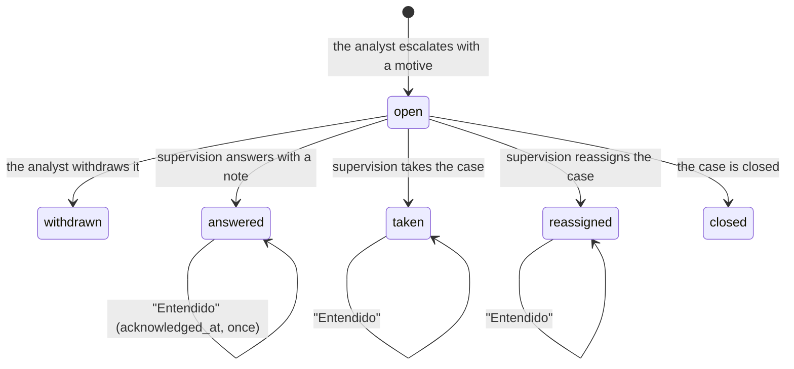
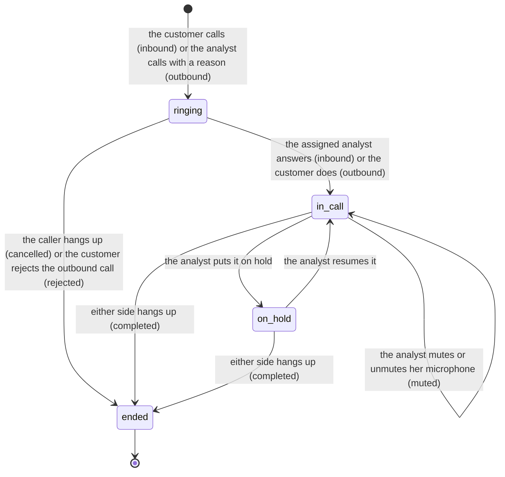

# Platform data model

Version: slices 0 to 12 (slice 7: customer rating; slice 8: case priority; slice 9: escalations to supervision; slice 10: notifications; slice 11: secure onboarding by invitation, part 4; slice 12: simulated phone and email). Source of truth: `backend/src/cc_platform/infrastructure/persistence/sqlalchemy/tables.py` (tables) and `backend/src/cc_platform/domain/` (rules and allowed values). The API contract is `backend/openapi.json`.

The platform is for people only: customers and support staff talk by chat and, since slice 12, by **simulated** phone and email (no telephony and no mail server: it stores the call's state, its times and what each person said, and the case's email thread). It stores the conversations, who handles each case, the staff accounts and the event log; nothing else (the [last section](#differences-from-data-labcontractssynthetic-sampleplatform_historyjson) compares this model with the synthetic sample).

## How it is stored

- SQLite by default, written in portable SQL so it moves to Postgres unchanged.
- **No migrations yet**: the schema is created on startup. If it changes, delete `backend/cc_platform.db` and it is recreated with the sample data.
- Prefixed text ids: `CASE-…`, `TRN-…` (message), `ASG-…` (assignment), `CUS-…` (customer), `STF-…` (staff member), `SES-…` (session), `MFA-…`, `TEAM-…` (team), `EVT-…` (event), `CSN-…` (customer session), `ESC-…` (escalation), `NTF-…` (notification), `INV-…` (invitation), `PWR-…` (password reset link), `EML-…` (dev mailbox email), `CALL-…` (call, slice 12).
- Dates in UTC (ISO-8601).
- Tables with a `version` column use optimistic concurrency control: if two people change the same thing at once, the second write is rejected and retried on fresh data.
- `turns` and `event_log` are append-only: rows are never edited or deleted.

## Diagram

```mermaid
erDiagram
    customers ||--o{ cases : "opens"
    customers ||--|| customer_case_slots : "at most one open case"
    cases ||--o{ turns : "messages"
    cases ||--o{ assignments : "assignment history"
    cases |o--o| cases : "previous_case_id"
    teams ||--o{ staff : "members"
    staff ||--o{ assignments : "receives"
    staff ||--o{ cases : "assigned_analyst_id"
    staff ||--|| login_accounts : "credentials"
    staff ||--o{ mfa_challenges : "codes"
    staff ||--o{ staff_sessions : "sessions"
    staff ||--o| analyst_availability : "available / paused"
    cases ||--o{ event_log : "case_id"
    cases ||--o{ escalations : "escalations (one open at a time)"
    cases ||--o{ calls : "calls (one active at a time, slice 12)"
    staff ||--o{ escalations : "escalated_by_id"
    staff ||--o{ notifications : "recipient_id (the latest 200)"
    staff ||--o| invitations : "one invitation per person"
    staff ||--o| password_resets : "one reset link per person"

    customers {
        string id PK "CUS-…"
        string display_name
        string country "CO MX AR BR"
        string city
        string locale "es-CO es-MX es-AR pt-BR"
        bool simulator
        json suggestions
    }
    cases {
        string id PK "CASE-…"
        string customer_id FK
        string channel "chat_app chat_web phone_inbound phone_outbound email"
        string language "es pt"
        string priority "none low medium high critical"
        string status "queued assigned in_progress closed"
        datetime opened_at
        datetime sla_due_at
        datetime first_response_at
        string previous_case_id
        string assigned_analyst_id FK
        datetime assigned_at
        datetime queued_at
        datetime closed_at
        string close_reason
        string close_note
        int rating_score "1 to 4, slice 7"
        string rating_comment
        datetime rated_at
        string rating_key
        string open_escalation_id "slice 9"
        string active_call_id "slice 12"
        int version
    }
    calls {
        string id PK "CALL-…"
        string case_id FK
        string customer_id FK
        string direction "inbound outbound"
        string state "ringing in_call on_hold ended"
        string reason "outbound: up to 500"
        string analyst_id
        datetime started_at
        datetime answered_at
        datetime ended_at
        string end_reason "completed cancelled rejected"
        string ended_by_role
        bool muted
        json holds "hold intervals"
        string creation_key
        int version
    }
    escalations {
        string id PK "ESC-…"
        string case_id FK
        string state "open answered taken reassigned withdrawn closed"
        string motive "up to 500"
        string escalated_by_id FK
        datetime escalated_at
        datetime resolved_at
        string resolved_by_id
        string note "supervision's answer"
        string reassigned_to_id
        datetime acknowledged_at
        string creation_key
        int version
    }
    turns {
        string id PK "TRN-…"
        string case_id FK
        int sequence "gapless per case"
        string kind "message routing notice transcript note email"
        string audience "everyone staff"
        string author_role "customer analyst system"
        string author_id
        text text
        string language
        datetime created_at
        string client_message_id
        string subject "emails only, slice 12"
    }
    assignments {
        string id PK "ASG-…"
        string case_id FK
        string staff_id FK
        string reason "language_least_loaded queue_drained manual outbound_call"
        string policy_rule_id "H1"
        int open_cases_at_assignment
        string assigned_by_role
        string assigned_by_id
        int waited_seconds
        string previous_staff_id
        bool paused_override
        datetime assigned_at
    }
    customer_case_slots {
        string customer_id PK
        string open_case_id
        int version
    }
    staff {
        string id PK "STF-…"
        string name
        string email UK
        json roles "analyst supervisor admin"
        json languages "es pt"
        string team_id FK
        bool active
        string setup "invited withdrawn complete (part 4)"
        datetime created_at
        int version
    }
    teams {
        string id PK "TEAM-…"
        string name
        string name_key UK
        bool active
        int version
    }
    admin_roster {
        string id PK "default"
        json admin_ids
        int version
    }
    login_accounts {
        string staff_id PK
        string password_hash
        int failed_attempts
        datetime locked_until
        datetime last_login_at
        string totp_secret "sealed (Fernet); null only on seeded accounts"
    }
    invitations {
        string id PK "INV-…"
        string staff_id FK "unique"
        string token_hash "SHA-256, unique"
        string state "pending accepted cancelled"
        datetime sent_at
        datetime expires_at "48 h"
        int resend_count
        int version
    }
    password_resets {
        string id PK "PWR-…"
        string staff_id FK "unique"
        string token_hash "SHA-256, unique"
        string state "pending used"
        datetime expires_at "1 h"
        int version
    }
    mfa_challenges {
        string id PK "MFA-…"
        string staff_id FK
        datetime expires_at
        int attempts
        string status
    }
    staff_sessions {
        string id PK "SES-…"
        string staff_id FK
        datetime issued_at
        datetime expires_at
        datetime ended_at
        string end_reason
    }
    analyst_availability {
        string staff_id PK
        string status "available paused"
        datetime since
    }
    notifications {
        string id PK "NTF-…"
        string recipient_id FK
        string kind "14 kinds (slice 10)"
        datetime created_at "when the fact happened"
        string source_key "EVT-… or sla:CASE-…"
        string case_id
        string customer_id
        string actor_id
        string target_id
        string escalation_id
        string language
        int score
        int failed_attempts
        datetime read_at
        int version
    }
    event_log {
        int sequence PK "total order"
        string event_id UK "EVT-…"
        string event_type
        string entity
        string entity_id
        string case_id
        string actor_role
        string actor_id
        datetime event_time
        datetime ingested_at
        json payload
    }
```

## Case lifecycle

```mermaid
stateDiagram-v2
    [*] --> queued: the customer writes
    queued --> assigned: someone available speaks the language,\nsomeone frees up, or supervision assigns it
    assigned --> in_progress: the analyst opens it or replies
    assigned --> assigned: supervision reassigns it
    in_progress --> assigned: supervision reassigns it
    assigned --> closed: the analyst closes it with a reason
    in_progress --> closed: the analyst closes it with a reason
    closed --> closed: the customer rates it (once, slice 7)
    assigned --> assigned: the analyst or supervision changes the priority (slice 8)
    assigned --> assigned: the analyst escalates to supervision (slice 9; the case stays with her)
    in_progress --> in_progress: the analyst escalates to supervision (slice 9)
    in_progress --> in_progress: the analyst or supervision changes the priority (slice 8)
    closed --> [*]
```

- A closed case is never reopened: if the customer writes again, a new case opens with `previous_case_id` pointing to the previous one.
- A customer has at most one open case (`customer_case_slots`).
- Rule 3 (`policy_rule_id = H1`): a Portuguese case only goes to someone who speaks Portuguese. Among the eligible, it goes to whoever has the fewest open cases. If nobody is available, it stays queued (`queued`).
- Customer rating (slice 7): only a **closed** case, **once**, and only by its own customer. It does
  not change the status (the case stays closed and read-only). It counts for whoever closed it
  (`closed_by_id`).
- First-response deadline (`sla_due_at`): 15 minutes for every case (slice 8; it used to depend
  on the priority). The analyst's first message sets `first_response_at`.
- Priority (slice 8): every case opens as `none` ("Sin prioridad"). It is changed by whoever
  handles it (with the Analista role) or by Supervisión (any open case, queued ones too); never
  on a closed case. It changes neither the status nor the first-response deadline. The levels
  follow the dataset's `complaints.priority` (Low, Medium, High, Critical) plus `none`.

- Escalation to supervision (slice 9): it only says that the case was escalated and why (the
  dataset only has `was_escalated` yes/no: there are no types, amounts, limits, levels or
  deadlines). The case's handler escalates it, one open at a time (`cases.open_escalation_id`);
  supervision answers, takes the case (if she is also an Analista and speaks the language) or
  reassigns it; closing the case ends it.

- Calls (slice 12, simulated): a case has at most one active call (`cases.active_call_id`);
  **a case with an active call cannot be closed** (409 `call_in_progress`: hang up first).
  Answering a call counts as a reply: the first one sets `first_response_at`. The case's channel
  says how it opened: a call or an email from a customer with an open case joins that case.

**Status in the analyst inbox** (computed, not stored):

| Inbox | Condition |
|---|---|
| Nuevos | `assigned` (the analyst has not opened it yet) |
| Por responder | `in_progress` and the last message is the customer's |
| Esperando al cliente | `in_progress` and the last message is the analyst's |
| Cerrados | `closed` in the last 7 days |

Slice 12: emails count as messages (last message, unread, Por responder); the lines of a call do
not (answering the call already was the reply).

## Tables

### Conversation

**`customers`** · minimal customer profile. Sample data only; no use case writes it yet.

| Column | Type | Notes |
|---|---|---|
| `id` | text, PK | `CUS-…` |
| `display_name` | text | visible name |
| `country` | text(2) | CO, MX, AR, BR |
| `city` | text | |
| `locale` | text | es-CO, es-MX, es-AR, pt-BR (sets the case language) |
| `simulator` | boolean | available in the customer simulator |
| `suggestions` | JSON | simulator opening phrases (demo only) |

**`cases`** · one chat, from the customer's first message to the close.

| Column | Type | Notes |
|---|---|---|
| `id` | text, PK | `CASE-…` |
| `customer_id` | FK → customers | |
| `channel` | text | how it opened (slice 12): `chat_app`, `chat_web`, `phone_inbound` (the customer called), `phone_outbound` (an analyst opened it to call the customer; sample data only), `email`. Formerly `app_chat` / `web_chat` |
| `language` | text | `es`, `pt` |
| `priority` | text | `none` (on open), `low`, `medium`, `high`, `critical` (slice 8); changed by the assigned analyst or Supervisión |
| `status` | text | `queued`, `assigned`, `in_progress`, `closed`, and (ADR 0003) `with_assistant`: the agent handles the case, nobody holds it and it is in no queue or inbox |
| `opened_at` | date | |
| `sla_due_at` | date | first-response deadline |
| `first_response_at` | date, null | the analyst's first message |
| `previous_case_id` | text, null | the same customer's previous case |
| `assigned_analyst_id` | FK → staff, null | current analyst |
| `assigned_at`, `queued_at` | date, null | |
| `queue_label` | text, null | queue name while it waits |
| `last_sequence`, `last_public_sequence` | integer | last message (all / visible to the customer) |
| `last_message_at`, `last_message_author_role`, `last_message_preview` | | summary of the last message for the inbox |
| `last_turn_author_role`, `last_turn_preview` | | same, including system notices |
| `assignee_read_sequence`, `unread_sequences` | integer, JSON | the assigned analyst's read state |
| `search_text` | text | normalized text for search |
| `closed_at`, `closed_by_id`, `closed_by_role` | | closure |
| `close_reason` | text, null | `resolved`, `customer_unresponsive`, `duplicate`, `out_of_scope`, `other` |
| `close_note` | text(500), null | optional note |
| `rating_score` | integer, null | customer rating (slice 7): 1 Mal, 2 Regular, 3 Bien, 4 Excelente; only on a closed case |
| `rating_comment` | text(500), null | optional customer comment (extra whitespace removed; empty = null) |
| `rated_at` | date, null | when the customer rated |
| `rating_key` | text(64), null | the request's `Idempotency-Key`: a retry with the same answer does not rate twice |
| `open_escalation_id` | text, null | the escalation open now (slice 9); at most one per case |
| `active_call_id` | text, null | the call ringing or in progress now (slice 12); at most one per case. While it is set, the case cannot be closed |
| `version` | integer | optimistic concurrency (a rating, a priority change or an escalation bumps the version: of two at once, one wins; a priority change also requires the version the requester saw, `expectedVersion`) |

Index for "Calificación 7 días" (slice 7): `ix_cases_closer_closed` (`closed_by_id`, `closed_at`).
Supervision groups the rated cases with `closed_at` in the last 7 days by who closed them (count
and average, a single query).

**Why in `cases` and not in a separate table.** The rating is a fact of the close, one per case
and written once; storing it in the same aggregate reuses its concurrency control (`version`)
and its event log, with no extra table and no extra uniqueness rule.

**`escalations`** · escalations to supervision (slice 9). One row per escalation: a case can be
escalated again once the previous one has ended.

| Column | Type | Notes |
|---|---|---|
| `id` | text, PK | `ESC-…` |
| `case_id` | FK → cases | |
| `state` | text | `open`, `answered`, `taken`, `reassigned`, `withdrawn`, `closed` |
| `motive` | text(500) | why it was escalated (staff text; the audit shows only its length) |
| `escalated_by_id`, `escalated_at` | FK → staff, date | who escalated (the case's handler) and when |
| `resolved_at`, `resolved_by_id` | date, text, null | when and by whom it ended |
| `note` | text(500), null | supervision's answer (`answered`; the audit shows only its length) |
| `reassigned_to_id` | text, null | who holds the case now (`taken`: whoever took it from supervision; `reassigned`) |
| `acknowledged_at` | date, null | the analyst read what supervision did ("Entendido") |
| `creation_key` | text(64), unique, null | `Idempotency-Key` of the request that opened it |
| `version` | integer | optimistic concurrency |

Indexes: `(case_id, escalated_at)`, `(state, escalated_at)` and `(resolved_at)` ("Escalados": the
open ones and those handled within the last hour). "Colas" (slice 9) uses
`ix_cases_language_status` (`language`, `status`) to read every open case of a language.

**Why an aggregate of its own and not columns in `cases`.** A case can be escalated more than
once and supervision lists escalations, not cases. The "one open per case" rule lives in the case
(`open_escalation_id`): every command that opens or ends an escalation also saves the case (it
writes a staff notice into the conversation), so the case's concurrency control orders them.

**`turns`** · every chat message or notice. Rows are only appended.

| Column | Type | Notes |
|---|---|---|
| `id` | text, PK | `TRN-…` |
| `case_id` | FK → cases | |
| `sequence` | integer | 1, 2, 3… gapless within the case (unique per case) |
| `kind` | text | `message` (written by a person), `routing` (assignment notice), `notice` (close, reassignment… notice); slice 12: `transcript` (one line of a call: said by the customer or the analyst, or `system` when it is put on hold, resumed or ended), `note` (the analyst's internal note, always `staff`), `email` (an email of the thread: from the customer = inbound, from an analyst = outbound) |
| `audience` | text | `everyone` (the customer sees it) or `staff` (staff only) |
| `author_role` | text | `customer`, `analyst`, `system` |
| `author_id` | text, null | `CUS-…` or `STF-…` |
| `text` | text | content |
| `language` | text | `es`, `pt` |
| `created_at` | date | |
| `client_message_id` | text, null | prevents duplicates on resend (unique per author) |
| `subject` | text(200), null | subject of an `email` (slice 12); null for the other kinds. A case's thread is its `email` turns in order; its subject is the first one's |

**`assignments`** · history of who each case was assigned to. "Inicio" indexes (slice 6):
`(staff_id, assigned_at)` and `(previous_staff_id, assigned_at)`, to read which cases reached an
analyst or were taken from her since her previous session. "Mientras no estabas" has no table of
its own: it is read from `event_log`, `assignments` and `cases`.

| Column | Type | Notes |
|---|---|---|
| `id` | text, PK | `ASG-…` |
| `case_id` | FK → cases | |
| `staff_id` | FK → staff | analyst who receives it |
| `reason` | text | `language_least_loaded` (on arrival), `queue_drained` (from the queue), `manual` (chosen by supervision), `outbound_call` (slice 12: the analyst opened the case to call the customer; sample data only) |
| `policy_rule_id` | text, null | `H1` (rule 3, language) |
| `open_cases_at_assignment` | integer | the analyst's load at that moment |
| `strategy` | text | assignment strategy used |
| `assigned_by_role`, `assigned_by_id` | text | system or supervision |
| `waited_seconds` | integer, null | time in the queue |
| `previous_staff_id` | text, null | who held it before (reassignment) |
| `paused_override` | boolean | assigned to a paused person after a confirmation |
| `assigned_at` | date | |

**`calls`** · simulated calls (slice 12). One row per call; the active one is also referenced by
`cases.active_call_id`. The transcript is not here: it is the case's `transcript` turns written
between `started_at` and `ended_at` (one active call at a time).

| Column | Type | Notes |
|---|---|---|
| `id` | text, PK | `CALL-…` |
| `case_id`, `customer_id` | FK | the case and its customer |
| `direction` | text | `inbound` (the customer called) or `outbound` (an analyst called) |
| `state` | text | `ringing`, `in_call`, `on_hold`, `ended` |
| `reason` | text(500), null | why the analyst calls (outbound only; the audit shows only its length) |
| `analyst_id` | text, null | who is on the line for the bank: the caller (outbound) or whoever answered (inbound; null while ringing) |
| `started_at`, `answered_at`, `ended_at` | date | started ringing, answered, ended |
| `end_reason` | text, null | `completed` (hung up after being answered), `cancelled` (the caller hung up while ringing), `rejected` (the customer rejected the outbound call) |
| `ended_by_role` | text, null | `customer` or `analyst` |
| `muted` | boolean | the analyst's microphone is muted |
| `holds` | JSON | hold intervals `[{started_at, ended_at}]` (`ended_at` null while still on hold) |
| `creation_key` | text(64), unique, null | the initiator's `Idempotency-Key`: a retry returns the same call |
| `version` | integer | optimistic concurrency |

Index: `(case_id, started_at)`. Duration (computed): `ended_at − answered_at` (holds included);
null if nobody answered.

**Why an aggregate of its own.** A case can have several calls over time, each with its own
times, holds and ending. The "one active per case" rule lives in the case (`active_call_id`):
starting and ending a call also saves the case, so its concurrency control orders a call against
a close or against another call.

**`customer_case_slots`** · guarantees a single open case per customer (`customer_id` PK, `open_case_id`, `version`).

### The assistant (ADR 0003, slice 14)

`assistant_sessions` — one row per case that opened in the agent's hands (`case_id` unique). Optimistic
locking like every aggregate. No message text is stored here (it lives in `turns`).

| Column | Type | Notes |
|---|---|---|
| `id` | text, PK | `AST-…` |
| `case_id` | FK → cases, unique | |
| `customer_id` | FK → customers | |
| `entry_agent` / `agent` | text | the agent the session started with / the one that answered last (`id@version`) |
| `agent_session_id` / `run_id` | text | agent-core's session and current run |
| `state` | text | `active`, `resolved`, `escalated`, `ended`, `failed`, `released` |
| `awaiting` | text | what agent-core waits for: `none`, `slot`, `confirmation`, `step_up`, `input` |
| `confirmation` / `step_up` | JSON | the pending confirmation (token, summary, expiry) / second factor (reason, simulated) |
| `step_up_verified_at`, `step_up_attempts` | | the simulated second factor |
| `processed_sequence` | int | the last customer message sent to the agent |
| `claim`, `claimed_at`, `queued`, `blocked`, `resend_blocked` | JSON/… | the input bookkeeping: one input in flight, a queued confirmation answer, an input blocked at a step-up |
| `handoff_ref`, `handoff_resolved_at` | | the escalation's handoff and when its label was sent |
| `failure_code`, `last_trace_id` | | why it ended; the agent-core trace id |
| `created_at`, `updated_at`, `version` | | |

`copilot_threads` (slice 15) — one row per (case, analyst), unique `(case_id, analyst_id)`: `id` `CPT-…`, `agent`, agent-core's `agent_session_id` / `run_id`, `runs` (the idempotency suffix of each run), `messages` (JSON list of `{id, role: analyst|copilot, text, created_at, client_message_id, answers}`, newest 200), `last_trace_id`, `version`. The text lives here; the event log carries sizes only.

`bank_customer_links` (`customer_id` PK → customers, `bank_customer_id`) — which dataset customer each
platform customer is; filled at startup from a private file.

### Notifications (slice 10)

**`notifications`** · what each staff member needs to know (the rail's bell). They are
**derived** from facts already in `event_log` (a projector subscribed to the event bus) and from
first-response deadlines about to expire (a periodic sweep). Structured data only: the frontend
renders the Spanish text with fixed templates. No AI.

| Column | Type | Notes |
|---|---|---|
| `id` | text, PK | `NTF-…` |
| `recipient_id` | FK → staff | who receives it |
| `kind` | text | Analista: `assigned_on_arrival`, `assigned_from_queue`, `assigned_by_supervisor`, `reassigned_away`, `customer_returned`, `escalation_answered`, `escalation_taken`, `escalation_reassigned`, `case_rated`; Supervisión: `case_escalated`, `case_queued`, `sla_at_risk`; Administración: `account_locked`, `invitation_accepted` |
| `created_at` | date | when the fact happened (the source event's time), not when it was written |
| `source_key` | text(80) | idempotency: the source event id (`EVT-…`) or the sweep's `sla:<case>`; unique per person |
| `case_id`, `customer_id` | text, null | the case and its customer (case kinds) |
| `actor_id` | text, null | who acted (the supervisor who assigned, answered or took; the analyst who escalated) |
| `target_id` | text, null | about whom (who holds the case now; the locked or invited person) |
| `escalation_id` | text, null | the escalation (`case_escalated`, `escalation_*`) |
| `language` | text, null | the case language |
| `score` | integer, null | `case_rated`: the rating (1 to 4) |
| `failed_attempts` | integer, null | `account_locked`: failed attempts |
| `read_at` | date, null | when it was read (once) |
| `version` | integer | optimistic concurrency (reading one is a compare-and-set; "Marcar todas" is a conditional `UPDATE … WHERE read_at IS NULL`) |

Indexes: unique `(recipient_id, source_key)`; `(recipient_id, created_at, id)` (the list, newest
first, with a cursor; and retention); `(recipient_id, read_at)` (unread count).

Rules: it never reaches whoever performed the action nor an inactive person; Supervisión and
Administración ones go to every active person with that role. "Un caso espera en la cola" arrives
once per language until the queue empties. "Caso por vencer sin respuesta": an open case without a
first response 5 minutes or less from its deadline, once per case, checked on startup and every
30 s (`CC_NOTIFICATION_SWEEP_SECONDS`). **Retention (team-generated):** the 200 most recent per
person are kept; older ones are deleted when a new one is written.

**Why they are not in `event_log`.** A notification is a projection of a fact already in the log
(`source_key` names it) and "read" is personal UI state: logging them would duplicate the audit.
See `api/slice-10-notifications.md`.

### People and access

| Table | What for | Main columns |
|---|---|---|
| `staff` | staff members | `id` (`STF-…`), `name`, `email` (unique), `roles` (JSON: `analyst`, `supervisor`, `admin`, combinable, at least one), `languages` (JSON: `es`, `pt`), `team_id` (FK → teams), `active`, `created_at`, `creation_key`, `setup` (part 4: `invited` = pending invitation, no password, cannot sign in; `withdrawn` = invitation cancelled before activation, not listed in the directory; `complete` = activated or seeded. Only a `complete` account can be `active`), `version` |
| `teams` | teams | `id` (`TEAM-…`), `name`, `name_key` (name without case or accents, unique), `active` (only deactivated with no active members), `created_at`, `creation_key`, `version` |
| `admin_roster` | guarantees there is always at least one active admin | a single row (`id = default`), `admin_ids` (JSON), `version` |
| `login_accounts` | credentials and lockout | `staff_id`, `password_hash` (Argon2id), `failed_attempts`, `locked_until` (5 failed attempts → 15 min), `last_login_at`, `totp_secret` (part 4: the key of her authenticator app, RFC 6238, **sealed** with Fernet; never shown again; null only on the seeded development accounts, which use the code `000000`). An invited person has no row until she activates her account |
| `invitations` | email invitations (part 4) | `id` (`INV-…`), `staff_id` (unique: one per person), `token_hash` (SHA-256 of the single-use link; the link is never stored), `state` (`pending`, `accepted`, `cancelled`; "expired" is computed: pending after `expires_at`), `created_at`, `sent_at` (last send), `expires_at` (48 h after the last send), `created_by`, `resend_count`, `accepted_at`, `cancelled_at`, `password_hash` and `totp_secret` (sealed) while the person is between step 1 and step 2, `failed_codes` / `locked_until` (5 wrong codes → 15 min), `version`. Resending replaces the link (the previous one stops working) |
| `password_resets` | password reset links (part 4) | `id` (`PWR-…`), `staff_id` (unique: one live link per person; a new one replaces the previous), `token_hash` (SHA-256), `state` (`pending`, `used`; expired is computed), `sent_at`, `expires_at` (1 h), `created_by`, `used_at`, `version` |
| `dev_mailbox` | development only: what the dev mailbox "sent" (part 4) | `id` (`EML-…`), `kind` (`invitation`, `password_reset`), `to_address`, `subject`, `text`, `link`, `sent_at`; the 200 most recent are kept. Never written in production (`CC_DEV_MAILBOX` forbids it) |
| `mfa_challenges` | verification code | `id`, `staff_id`, `issued_at`, `expires_at`, `max_attempts`, `attempts`, `status` (cancelled if the password is reset or the person is deactivated), `verified_at`, `method` |
| `staff_sessions` | started sessions | `id`, `staff_id`, `issued_at`, `expires_at`, `mfa_method`, `ended_at`, `end_reason` |
| `analyst_availability` | available or paused | `staff_id`, `status` (`available`, `paused`), `since` |

**Secure onboarding (part 4).** No table stores a plaintext password, a link or a readable
verification key: only hashes (Argon2id for passwords, SHA-256 for single-use links) and the
sealed TOTP key. Events never carry emails, links, passwords or keys. See
`api/slice-11-invitations.md`.

### Event log

**`event_log`** · every state change leaves a row. Rows are only appended.

| Column | Type | Notes |
|---|---|---|
| `sequence` | integer, PK | total arrival order (pagination and export) |
| `event_id` | text, unique | `EVT-…` |
| `event_type` | text | see the list below |
| `entity`, `entity_id` | text | which entity it happened to |
| `case_id` | text, null | related case |
| `actor_role`, `actor_id` | text | `customer`, `analyst`, `supervisor`, `admin` or `system`, and its id |
| `event_time` | date | when it happened |
| `ingested_at` | date | when it was stored |
| `payload` | JSON | event detail |

Event types:

| Family | Events |
|---|---|
| Cases | `case.opened`, `case.queued`, `case.assigned`, `case.status_changed`, `case.read`, `case.first_responded`, `case.closed`, `case.rated` (the customer rated; `payload`: `score`, `comment`, `analyst_id`; the audit shows only the comment's length), `case.priority_changed` (slice 8; `payload`: `from`, `to`; audit: "Cambió la prioridad a Alta"), `case.viewed` (supervision opened the case) |
| Escalations (slice 9) | `escalation.opened` (`motive`, `analyst_id`; audit: "Escaló el caso a supervisión", only the motive's length), `escalation.withdrawn`, `escalation.answered` (`note`; only its length), `escalation.taken`, `escalation.reassigned` (`previous_analyst_id`, `analyst_id`), `escalation.closed`, `escalation.acknowledged` |
| Messages | `turn.created` (slice 12: also call lines, internal notes and emails; emails carry `subject`, which the audit shows only as a length) |
| Calls (slice 12) | `call.started` (`direction`, `customer_id`, `analyst_id`, `reason`: only its length in the audit; "Llamó a la línea de atención" / "Llamó a {cliente}"), `call.answered` (`answered_by_role`, `analyst_id`, `ring_seconds`), `call.held`, `call.resumed` (`hold_seconds`), `call.mute_changed` (`muted`), `call.ended` (`end_reason`, `ended_by_role`, `answered`, `duration_seconds`, `hold_seconds`); `conversation` family, all of them change something |
| Staff | `staff.availability_changed` |
| Administration | `staff.created`, `staff.profile_updated`, `staff.roles_changed`, `staff.languages_changed`, `staff.team_changed`, `staff.deactivated`, `staff.reactivated`, `staff.account_unlocked`, `team.created`, `team.renamed`, `team.deactivated`, `team.reactivated`; part 4: `staff.invitation_sent` (`invitation_id`, `expires_at`), `staff.invitation_resent` (+ `resend_count`), `staff.invitation_cancelled`, `staff.password_reset_link_sent` (`reset_id`, `expires_at`, `revoked_sessions`, `cleared_lock`) |
| Access | `auth.login_failed`, `auth.password_accepted`, `auth.mfa_challenge_issued`, `auth.mfa_failed`, `auth.account_locked`, `auth.session_started`, `auth.session_ended`, `customer.session_started`; part 4 (the person herself): `staff.invitation_accepted` (`invitation_id`), `staff.mfa_enrolled` (`method: totp`), `staff.password_reset` (`cleared_lock`: she created her new password with the link) |

## What may still change

- Slice 7 adds the rating columns to `cases`: a database created earlier fails on startup
  (`OutdatedSchemaError`) until it is deleted.
- Slice 8 adds no columns, but it changes the `priority` values, the first-response deadline and
  the seeded story: delete `backend/cc_platform.db` to see them (an older database starts, with
  `medium` on its cases and the old deadlines).
- Slice 9 adds the `escalations` table and the `cases.open_escalation_id` column: an older
  database fails on startup (`OutdatedSchemaError`) until it is deleted.
- Slice 10 adds the `notifications` table: an older database fails on startup
  (`OutdatedSchemaError`) until it is deleted.
- Slice 11 (part 4) adds the `invitations`, `password_resets` and `dev_mailbox` tables and the
  `staff.setup` and `login_accounts.totp_secret` columns: an older database fails on startup
  (`OutdatedSchemaError`) until it is deleted.
- Slice 12 adds the `calls` table and the `cases.active_call_id` and `turns.subject` columns, and
  renames the channels (`app_chat` → `chat_app`, `web_chat` → `chat_web`): an older database
  fails on startup (`OutdatedSchemaError`) until it is deleted.
- Known gap: there are no migrations. Any future schema change requires deleting `backend/cc_platform.db` until they are added.

## Differences from `data-lab/contracts/synthetic-sample/platform_history.json`

That contract (v0.5.1) describes the synthetic sample we shared with the AI team, which included the full platform with AI. The platform built is a subset:

| In the sample contract | In the platform |
|---|---|
| `case`, `turn` | yes (`cases`, `turns`); the case lacks `origin`, `topic`, `complaint_id` and the message lacks `from_suggestion_id`, `evidence_ids` |
| `case_close` (`resolved`, `contact_reason`, `resolution_code`, `followup_at`, `csat`) | different: inside `cases`, `close_reason` and `close_note`; `csat` (same 1-to-4 scale) is `rating_score` + `rating_comment`, set by the customer after the close (slice 7) |
| `was_escalated` (yes/no) | yes, as `escalations`: the motive and what supervision did; no types, amounts, levels or deadlines |
| `routing_step` (judge, tree, agent, human) | no: the case goes straight to a person; who received it and why is in `assignments`, which is new |
| channels `phone`, `email`; origin `regulator`, `branch` | `phone` and `email` yes, simulated (slice 12: `phone_inbound`, `phone_outbound`, `email`, no telephony and no mail server); chat is `chat_app` and `chat_web`; there is no `regulator` or `branch` origin |
| case topic (`topic`) | does not exist (the judge used to set it) |
| `tool_call`, `identity_check`, `copilot_query`, `approval`, `suggestion`, `signal`, `component` | do not exist |
